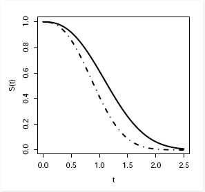

# Libraraies and Setup

Menyiapkan markdown document
```{r setup, include=FALSE}
# clear-up the environment
rm(list = ls())

# chunk options
knitr::opts_chunk$set(
  message = FALSE,
  warning = FALSE,
  fig.align = "center",
  comment = "#>"
)

# scientific notation
options(scipen = 9999)
```

Memanggil library yang akan digunakan
```{r}
library(survival)
library(survminer)
library(dplyr)
```

# Pengantar Analisis Survival

## Analisis Survival

Analisis survival merupakan suatu metode  statistika yang hasilnya berupa **waktu sampai suatu event terjadi** dan **peluang survive nya**, dimulai dari time origin (start point) sampai dengan terjadinya suatu event (end point). Pada analisis survival waktu sampai suatu event terjadi merujuk pada waktu suatu individu untuk survive. **Waktu** tersebut dapat berupa tahun, bulan, hari, jam, atau bahkan menit yang diukur sejak pengamatan dimulai hingga muncul kejadian. **Event** yang diamati dapat berupa kematian, kesembuhan, kekambuhan penyakit, kerusakan, kelulusan, dan lain-lain.

## Penerapan Analisis Survival

1. Orang yang berusia 60 tahun dilihat waktu sampai dia meninggal (peluang survive = 0)

2. Penerima transplantasi organ dilihat waktu sampai dia meninggal (peluang survive = 0)

## Goals of Survival Analysis

- **Goal 1**: Interpretasi fungsi survival dan hazard serta hubungan kausalitas antara prediktor dengan waktu survive
- **Goal 2**: Mengestimasi peluang survive dan rata-rata waktu survive
- **Goal 3**: Membandingkan peluang survive dari beberapa perlakuan yang berbeda

## Data untuk Analisis Survival

Analisis survival memerlukan data berupa waktu survive yang disebut dengan data survival. Data survival terdiri dari 3 komponen, yaitu :

1. **Kejadian (Event)**

Event biasanya merujuk pada sesuatu yang negatif misal kematian atau kerusakan padahal perlu di garis bawahi bahwa event dapat pula merujuk pada sesuatu yang positif, misal kesembuhan atau kelulusan. Jenis event:

- Terminate 

Pengamatan hanya dilakukan sampai terjadi event pertama. Contoh : kematian, kerusakan

- Tidak Terminate

Pengamatan dilakukan secara berkelanjutan setelah terjadi event pertama. Contoh : status berat badan, stadium penyakit

2. **Origin**

Titik asal (origin), yaitu titik awal yang digunakan untuk mengukur lama waktu sampai terjadi event.

3. **Satuan waktu**

Satuan waktu yang digunakan pada analisis survival.

**Censoring (incomplete data)**

* *Data terpotong*

- Data terpotong kiri: 

Pada 10 orang yang usianya 50 tahun ke atas diukur lama waktu sampai meninggal, namun ada 3 orang yang sudah meninggal sebelum usia 50 tahun

- Data trerpotong kanan: 

Pada 10 orang pasien diukur lama waktu sampai penyakitnya kambuh kembali, namun dari 10 orang pasien terdapat 2 orang pasien yang dinyatakan belum sembuh

* *Data tersensor*

- Data tersensor kiri: 

Pada suatu penelitian yang dilakukan terhadap 10 orang ingin diketahui faktor-faktor yang menyebabkan seseorang menjadi perokok, namun terdapat 1 orang yang lupa sejak kapan ia mulai merokok tetapi mengingat ia mulai merokok pada usia tertentu

- Data tersensor kanan:

1. Tipe I: Subjek tidak mengalami event selama penelitian
  
2. Tipe II: Observasi yang mengalami event ditentukan terlebih dahulu
  
3. Random censorig: Subjek menghilang selama masa pengamatan

## Survival Analysis in R

Pada materi ini kita akan menggunakan beberapa package yang ada di R, yaitu `survival` untuk melakukan analisis survival dan `survminer` untuk memvisualisasikan hasil analisis survival. 

['survminer' cheat sheet](www.sthda.com/english/wiki/survminer-cheatsheet-to-create-easily-survival-plots)

Bagaiaman mengambil data (sampling) untuk melakukan analisis survival ?

contoh:

Dikumpulkan data lama waktu 10 lampu selama 12 bulan sampai lampu mengalami kerusakan (1 = mati). Jika event adalah lampu rusak (mati) dan origin adalah pada saat lampu pertama kali dipasang, diperoleh data sebagai berikut:
```{r}
t_lampu <- c(12,7,3,10,12,12,8,6,8,10)
kondisi <- c(0,1,0,1,1,0,1,0,0,1)
```

Membuat objek survival
```{r}
lampu <- Surv(t_lampu,kondisi)
lampu
```

Tanda `+` dia atas menjelaskan event yang terjadi (+ berarti event tidak terjadi samapai akhir pengamatan). Coba gabungkan `t_lampu`, `kondisi`, dan `lampu` dengan fungsi `cbind()` 
```{r}
cbind(t_lampu,kondisi,lampu) %>% head()
```

# Statistics Behind Survival Analysis

## Survival and hazard function

Fungsi survival $S(t)$ didefinisikan sebagai peluang suatu individu dapat bertahan hidup dengan waktu survive sampai waktu $t$. Atau lebih sederhana, fungsi survival yaitu peluang individu tidak mengalami event sampai waktu $t$. Fungsi survival merupakan peluang, oleh karena itu nilainya berkisar antara 0 sampai dengan 1.

 

Salah satu karakteristik dari fungsi survival yaitu pada saat $t=0$ maka $S(t)=1$, semakin panjang waktu atau $t$ maka nilai $S(t)$ semakin turun mendekati 0. Dapat dilihat pada Gambar diatas grafik fungsi survival antara 2 pasien yaitu A dengan garis tebal, dan B dengan garis putus-putus. Berdasarkan grafik tersebut diketahui bahwa pada saat $t=0$ maka $S(t)$ dari kedua pasien tersebut sama-sama bernilai 1, atau dapat pula diartikan bahwa pada saat kedua pasien dirawat pada hari ke-0 maka peluang pasien untuk tidak mengalami event (sembuh) adalah 1. Selanjutnya yaitu dapat diketahui bahwa semakin panjang lama waktu pasien dirawat maka peluang pasien untuk mengalami event (sembuh) yaitu mendekati 0.

Jika ditanya “Pasien mana yang lebih cepat sembuh?” jawabaannya adalah pasien B. Karena dapat dilihat bahwa grafik $S(t)$ pasien B selalu dibawah pasien A, ingat bahwa $S(t)$ merupakan peluang untuk tidak mengalami event oleh karena itu berarti peluang pasien B untuk sembuh lebih kecil daripada peluang pasien A.

Fungsi hazard merupakan tingkat terjadinya event sampai dengan waktu t. Bisa dikatakan bahwa fungsi hazard merupakan lawan dari fungsi survival, jika fungsi survival yaitu peluang untuk tidak mengalami event sedangkan fungsi hazard merupakan tingkat terjadinya event (sering disebut tingkat resiko). Fungsi hazard bukan peluang, oleh karena itu selalu bernilai positif.

## Non-Parametrik Survival

Statistik non-parametrik tidak didasarkan pada asumsi distribusi probabilitas dan cukup masuk akal digunakan pada analisis survival karena data survival memiliki distribusi yang condong (skewness).

### Kaplan-Meier

Kaplan-Meier pertama kali diperkenalkan oleh Edward Kaplan dan Paul Meier pada tahun 1958 di Journal of American Statistics Association. Kaplan-meier mengestimasi peluang seorang pasien akan bertahan melewati waktu $t$ tertentu. Pada $t = 0$, Kaplan-Meier mengestimasi peluang seorang pasien akan bertahan adalah 1 dan semakin tak terhingga $t$, peluangnya menjadi 0. 

Kita akan menggunakan data `lung`
```{r}
head(lung)
str(lung)
```

The variabels are:

* `Inst`: kode institusi
* `Time`: waktu survive dalam hari
* `Status`: status penyensoran (1 = tersensor, 2 = meninggal)
* `Age`: usia pasien dalam tahun
* `Sex` : jenis kelamin (1 = laki-laki, 2 = perempuan)
* `Ph.ecog`: skala yang digunakan dokter untuk mengetahui level kondisi pasien (0-5 = baik-meninggal)
* `Ph.karno`: skala karnofsky yang dinilai dari dokter (0-100 = buruk-baik)
* `Pat.karno`: skala karnofsky dari pasien
* `Meal.cal`: banyak kalori yang dikonsumsi
* `Wt.loss`: banyak berat badan yang berkurang dalam kurun waktu 6 bulan terakhir

Data `lung` yang digunakan harus dilakukan tahapan pre-proses terlebih dahulu
```{r}
lung <- lung %>% 
  select(-inst) %>% 
  mutate(sex = as.factor(sex))
```

```{r}
colSums(is.na(lung))
lung_noNA <- na.omit(lung)
```

Setelah data dipastikan `clean` kita harus membuat objek survival dengan menggunakan fungsi `Surv()`.
```{r}
surv_lung <- Surv(time = lung$time, event = lung$status)
```

Kita akan melakukan analisis survival dengan model `kaplan-meier` dengan meggunakan fungsi `survfit()`. 
```{r}
km_lung <- survfit(surv_lung ~ sex, data = lung)
```

Kita bisa melihat output dengan memanggil objek `km_lung`
```{r}
km_lung
```

Untuk melihat pengaruh `sex` terhadap survive atau tidaknya seseorang dari kanker paru-paru, kita bisa melakukan visualisasi dengan menggunakan fungsi `ggsurvplot`. Parameter yang digunakan, yaitu:

* model yang akan diplotkan
* pval: logical, jika TRUE p-value dari uji log rank untuk sex akan ditampilkan
* risk.table: logical, jika TRUE tabel resiko akan ditampilkan
```{r}
ggsurvplot(km_lung, 
        pval = TRUE, 
        risk.table = TRUE) 
```

Untuk melakukan visualisasi fungsi hazard bisa menggunakan fungsi `ggsurvplot()` dengan parameter tambahan, yaitu `fun = "cumhaz"` dan data yang digunakan.
```{r}
ggsurvplot(km_lung,
           fun = "cumhaz", 
           data = lung) 
```

### Nelson-Aalen

Estimasi Nelson-Aalen pada dasarnya sama dengan estimasi Kaplan-Meier tetapi parameter phi dipandang sebagai tingkat terjadinya event pada saat $t$. Bisa dikatakan bahwa phi merupakan estimasi untunk fungsi hazard pada saat $t$.

```{r}
na_lung <- survfit(coxph(surv_lung ~ sex, method = "breslow", data = lung))
```

### Log-Rank Test

Uji Log-Rank pertama kali diperkenalkan oleh Nathan Mantel pada tahun 1972. Uji Log-Rank merupakan metode yang digunakan untuk membandingkan apakah terdapat perbedaan peluang survive antar beberapa perlakuan. Hipotesis untuk uji Log-Rank, yaitu:

H0 : Tidak ada perbedaan peluang survive antar perlakuan
H1 : Paling sedikit ada satu perlakuan yang membuat peluang survivenya berbeda 

```{r}
lr_lung <- survdiff(Surv(time, status) ~ sex, data = lung) 
```

## Parametrik Survival

Berbeda dari statistik non-parametrik, statistik parametrik didasarkan pada asumsi distribusi probabilitas tertentu dan diduga terdapat variabel lain (prediktor) yang mempengaruhi lama waktu sampai terjadi suatu event.

```{r}
Reg_lung <- survreg(Surv(time,status)~ sex,dist="exponential", data = lung)
```

## Semi Parametrik

Cox Proportional Hazard Model memodelkan fungsi baseline hazard nya secara non-parametrik dan fungsi variabel prediktornya secara parametrik.  

```{r}
cox_lung_noNA <- coxph(surv_lung ~ age + sex + ph.ecog + ph.karno + pat.karno + meal.cal + wt.loss, data = lung)

summary(cox_lung_noNA)
```


