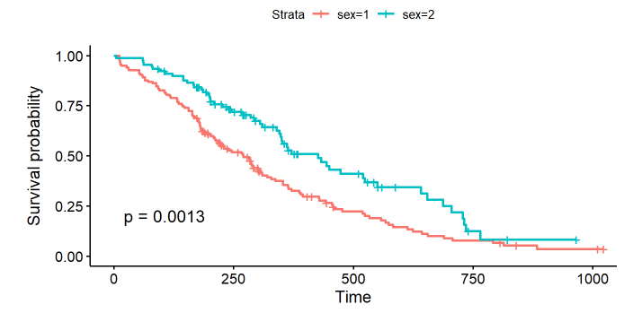

1.  To do survival analysis the data must changed into survival object first. 
    which of the functions below is appropriate ?
    - [ ] `survit()`
    - [ ] `Surv()`
    - [ ] `survdiff()`
2.  Which is `not censored` observation is ?
    - [ ] Those that are lost to followup
    - [ ] Those who experience the event after the followup period 
        of the study
    - [ ] Those who experience the event during the followup period 
        of the study 
3.  Which is the most appropriate way of interprating weibull model ?
    - [ ] Odds ratio
    - [ ] Probability
    - [ ] Proportion failing
4.  Which statement below describes cox regression analysis ?
    - [ ] Parametric model
    - [ ] Is used to analyse survival data when individuals in the study 
        are followed for varying lengths of time
    - [ ] Method for investigating the effect of several variables upon 
        the time a specified event takes to happen

5.  Considering the results above. What is the more usual term for 
    the y axis ?
    - [ ] Inverse hazard
    - [ ] Survival function S(t)
    - [ ] Time-to-event (time duration until the event occurs)

